# Day 1｜認識版本控制與基礎操作
## 📖 一、版本控制簡介

### 1.1 為什麼需要版本控制？
- **記錄檔案歷史**：避免改壞檔案後無法恢復
- **多人協作**：避免互相覆蓋檔案，確保團隊合作順暢
- **版本追蹤**：每個版本都有記錄，方便追蹤問題來源
- **分支開發**：可以同時進行多個功能開發

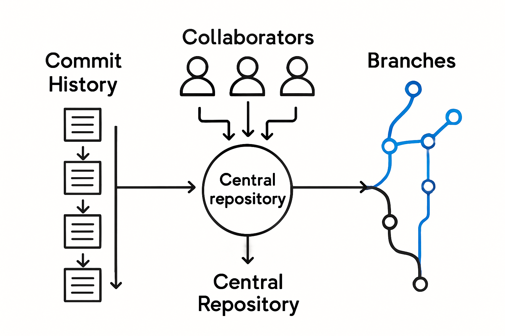

### 1.2 Git 與 Sourcetree 的角色
- **Git**：分散式版本控制系統，管理代碼歷史和分支。
- **Sourcetree**：圖形化界面，簡化 Git 操作。

---

## ⚙️ 二、Git 與 SourceTree 安裝

### 2.1 安裝 Git

#### 快速安裝步驟
1. 前往 [Git 官方網站](https://git-scm.com/downloads)
2. 選擇對應作業系統版本下載
3. 按照安裝精靈完成安裝

#### 驗證 Git 安裝
```bash
git --version
```
如果顯示版本號，表示安裝成功

### 2.2 安裝 Sourcetree

#### 基本安裝步驟
1. 前往 [Sourcetree 官方網站](https://www.sourcetreeapp.com/)
2. 下載對應版本並執行安裝檔案
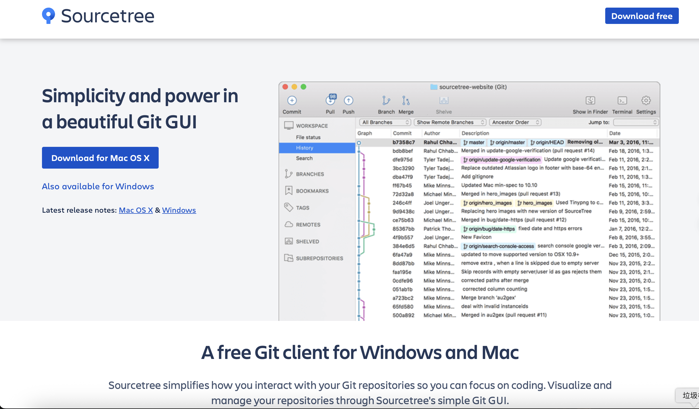
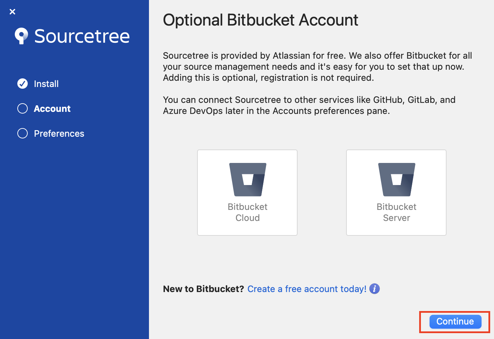
3. 這裡要填的 Author Name 跟 Author Email Address是用來標記你在 Git 裡做的每一次 commit 的作者資訊 (建議填 GitHub 綁定的名稱與 Email)
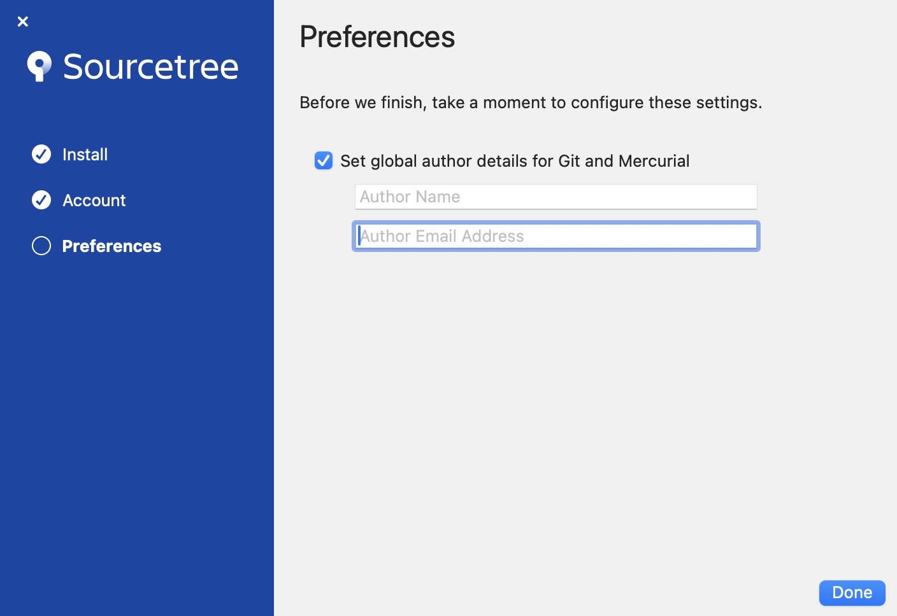
---

## 🚀 三、專案建立與基礎操作

### 3.1 建立本地專案

#### 建立新的本地專案
1. **開啟 Sourcetree**
2. **點擊「New」按鈕**
3. **選擇「Create Local Repository」**
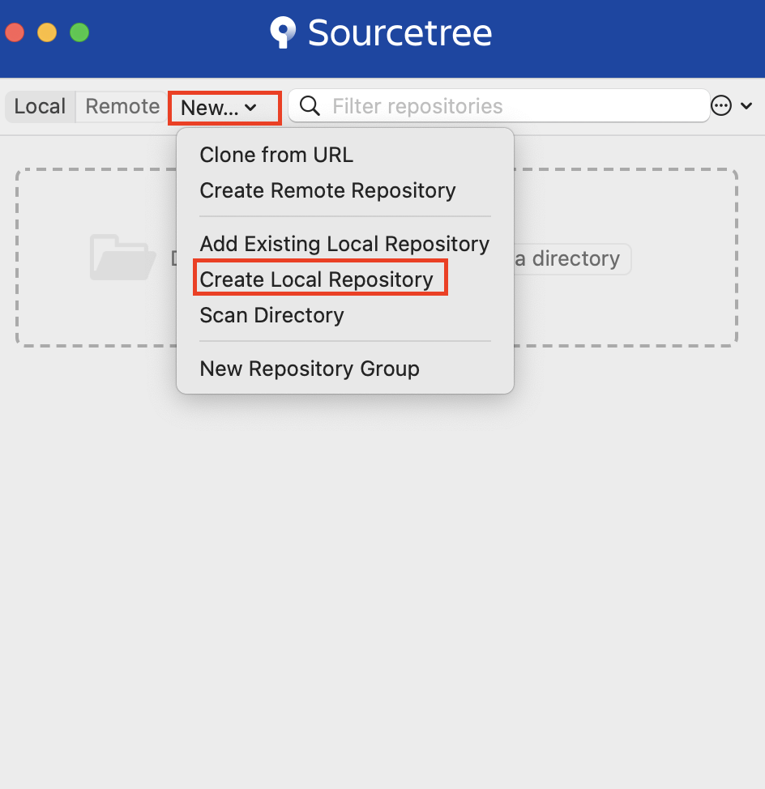
4. **設定專案資訊**：
   - 選擇專案存放位置
   - 輸入專案名稱
   - 選擇專案類型（Git）
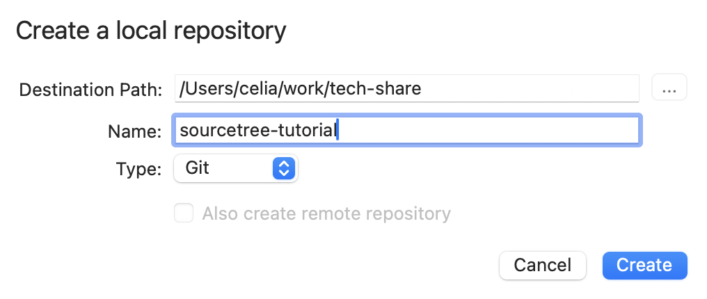
5. **點擊「Create」完成建立**
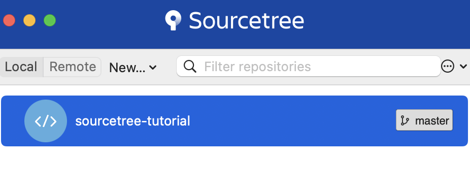


### 3.2 加入檔案與提交（Commit）

#### 基本提交流程
1. **修改檔案**：在專案資料夾中新增或修改檔案
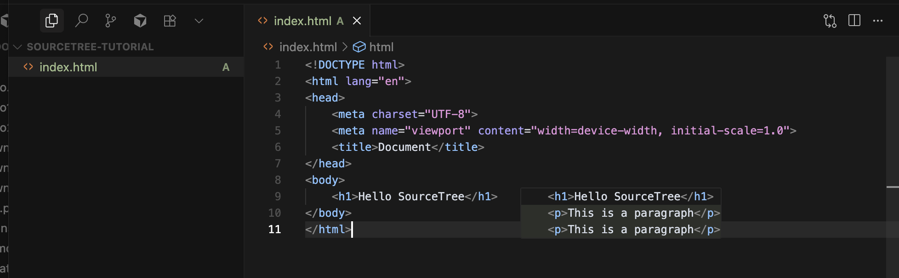
2. **檢視檔案狀態**：
   - 開啟 Sourcetree，切換到「File Status」頁籤
   - 檢視「Unstaged files」區域的異動檔案
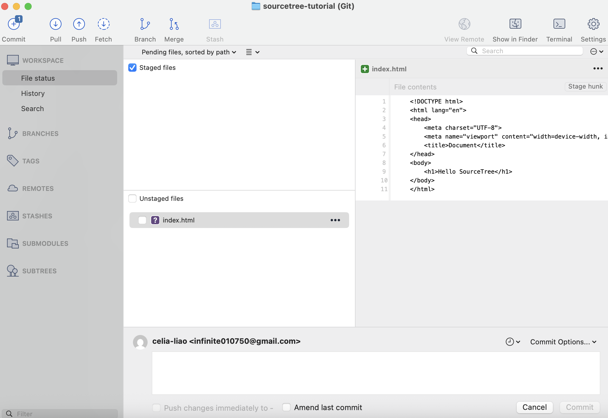

3. **Stage 檔案**：
   - 將檔案從「Unstaged files」移動到「Staged files」
   - 方法：勾選要提交的檔案，或點擊「Stage All」
   - 可以選擇性地 stage 特定檔案
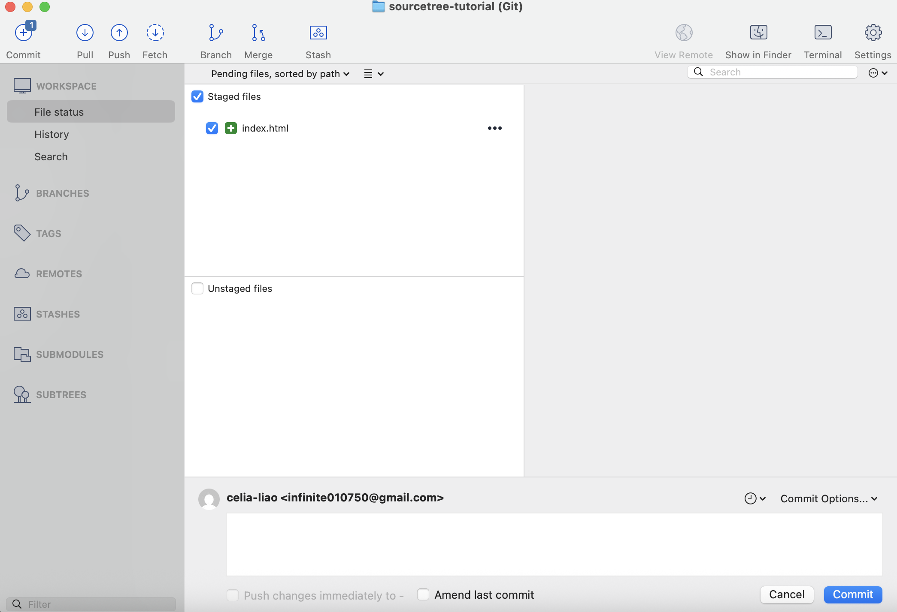
4. **撰寫提交訊息**：
   - 在下方的訊息欄位輸入 commit 訊息
   - 簡潔明確（建議：動詞 + 短描述）
   - 例如：「新增登入功能」、「修正登入 bug」
5. **執行 Commit**：
   - 確認分支位置正確
   - 點擊「Commit」按鈕完成提交

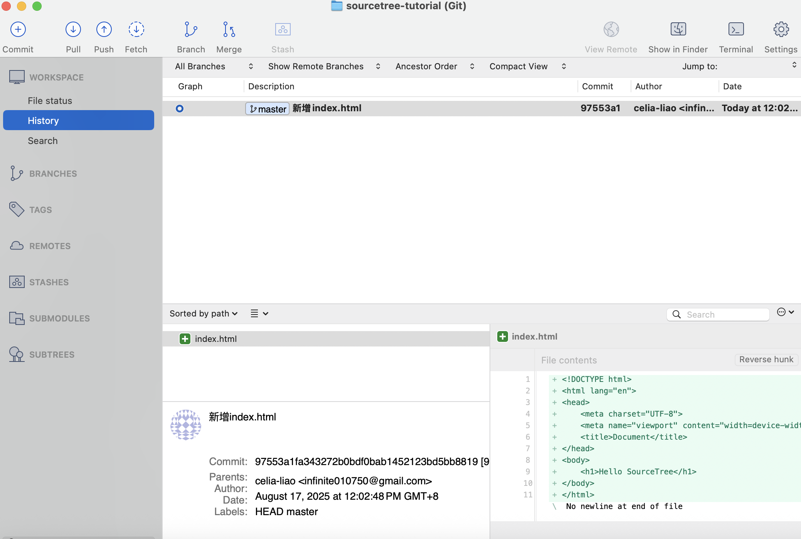

#### 良好的 Commit 訊息範例
- ✅ 新增使用者註冊功能
- ✅ 修正密碼驗證邏輯
- ✅ 更新首頁樣式
- ❌ 修改檔案
- ❌ bug fix

### 3.3 回溯歷史

#### Checkout：查看歷史版本
1. 在歷史記錄中選擇想查看的 commit
2. 右鍵選擇「Checkout」
3. 進入「Detached HEAD」狀態查看
4. 查看完畢後回到主分支


#### Reset：回到舊版本
1. 在歷史記錄中選擇目標 commit
2. 右鍵選擇「Reset current branch to this commit」
3. 選擇模式：
   - **Soft**：保留檔案修改
   - **Mixed**：保留檔案但取消 Stage
   - **Hard**：完全回溯，捨棄所有修改

、

⚠️ **注意**：Reset Hard 會永久刪除修改，使用前請確認！

👉 下一篇：[Day 2｜遠端倉庫連線與同步](2_remote_sync.md)
