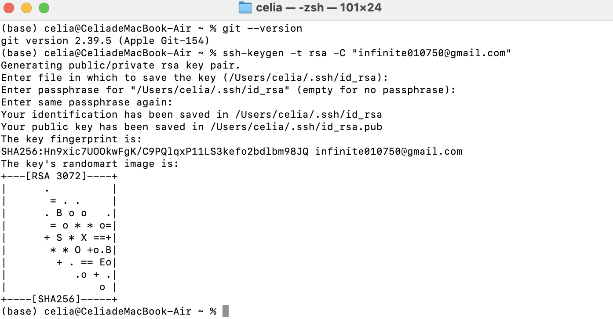
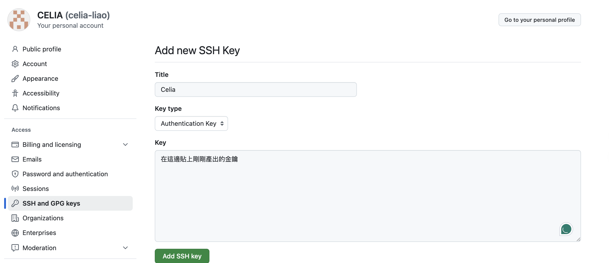
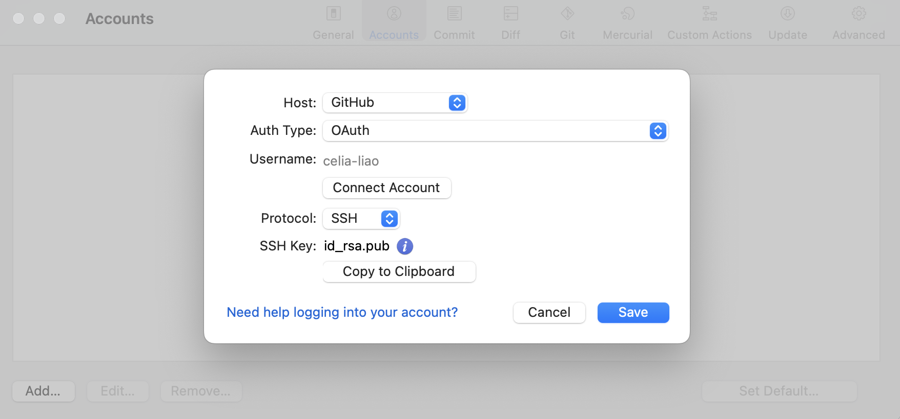

# Day 2｜遠端倉庫連線與同步

## 🔗 **前言**
在 Day 1 我們學會了本地專案的建立和基本 Git 操作。今天我們要將本地專案連接到雲端，學習與團隊成員或其他裝置同步代碼的技能。

---

## 🔗 一、SSH 金鑰產生與設定

### 1.1 為什麼需要 SSH 金鑰？
- **安全連線**：提供加密的安全連線方式
- **免密碼登入**：避免每次都要輸入帳號密碼
- **身份驗證**：確保只有授權的使用者可以存取倉庫

### 1.2 生成和設置 SSH 金鑰

#### 使用 Sourcetree 內建終端機
1. **開啟 Terminal**：
   - 在 Sourcetree 上方選單選擇「Terminal」
   - 或使用快捷鍵開啟終端機

2. **確認 Git 是否安裝**：
   ```bash
   git --version
   ```

3. **生成 SSH 金鑰**：
   ```bash
   ssh-keygen -t ed25519 -C "自訂字串或Email"
   ```

4. **設置金鑰**：
   - **金鑰存放位置**：全部直接按 Enter 使用預設設定
   - **密碼保護**：可設定或留空（建議設定）
   - **確認密碼**：重複輸入密碼

   

🔑 **步驟一：複製公鑰內容**

在 Terminal 輸入：

```bash
cat ~/.ssh/id_ed25519.pub
```

這會顯示整串以 ssh-rsa ... 開頭、最後帶有你 email 的字串。

👉 **請完整複製這一整串（不能漏掉換行或空白）**

5. **將公鑰新增到 GitHub**：
   - 前往 GitHub → Settings → SSH and GPG keys
   - 點擊「New SSH key」
   - 輸入標題（例如：「我的電腦」）
   - 貼上公鑰內容並儲存

   

6. **測試 SSH 連線**：
   ```bash
   ssh -T git@github.com
   ```
   看到歡迎訊息表示設定成功！

7. **SourceTree 設定帳號**：
   - 建立剛剛的 SSH
   

---

## 🌐 二、建立與連結遠端倉庫

### 2.1 建立遠端 Repository

#### 平台選擇
- **GitHub**：最受歡迎的程式碼託管平台
- **GitLab**：提供免費私有倉庫
- **Bitbucket**：Atlassian 產品，與 Sourcetree 整合度高

#### 在 GitHub 建立新倉庫
1. 登入 GitHub 網站
2. 點擊右上角「+」→「New repository」
3. 輸入倉庫名稱
4. 選擇公開（Public）或私有（Private）
5. 可選擇自動建立 README 檔案
6. 點擊「Create repository」

### 2.2 連結專案與遠端倉庫

#### 方法一：Clone 現有遠端專案
當遠端已有專案時，可以直接 Clone 到本地：
1. **點擊「Clone」按鈕**
2. **輸入來源資訊**：
   - 遠端倉庫 SSH URL：`git@github.com:username/repository.git`
   - 選擇本地存放路徑
   - 設定專案名稱
3. **點擊「Clone」開始下載**

#### 方法二：將現有本地專案連結到遠端
已有本地專案，要連結到新建的遠端倉庫：

1. **設定 SSH Client**：
   - 選擇「Tools」→「Options」（Windows）或「Preferences」（macOS）
   - SSH Client 選擇「OpenSSH」
   - SSH Key 指向您的私鑰檔案路徑

2. **新增 Remote 連結**：
   - 開啟您的本地專案
   - 選擇「Repository」→「Repository Settings」
   - 點擊「Add」新增遠端
   - 輸入遠端 SSH URL 和名稱（通常命名為 origin）
   - 範例：`git@github.com:username/repository.git`

---

## 🔄 三、Push（上傳）與 Pull（下載）操作

### 3.1 Push：上傳本地提交到遠端

#### 首次 Push
1. **確認 Commit 完成**：確保本地有 commit 記錄
2. **點擊 Push 按鈕**：在 Sourcetree 工具列點擊「Push」
3. **選擇推送選項**：
   - 勾選要推送的分支（通常是 main 或 master）
   - 首次推送可勾選「Push all branches」
   - 如有標籤可勾選「Push all tags」
4. **確認目標**：確認推送到正確的遠端倉庫
5. **執行 Push**：點擊「Push」按鈕完成推送

#### 日常 Push 流程
1. **完成本地 commit**：確保所有修改都已 commit
2. **點擊 Push 按鈕**：工具列的「Push」按鈕
3. **檢查狀態**：
   - 確認當前分支
   - 檢視要推送的 commit 數量
4. **選擇分支**：選擇要推送的分支
5. **執行推送**：點擊「Push」完成上傳

### 3.2 Pull：更新遠端最新版本到本地

#### Fetch & Pull 操作流程

**步驟一：Fetch（取得更新）**
1. **點擊 Fetch 按鈕**：取得最新異動紀錄
2. **檢查更新**：如果看到向下箭頭，代表有資料須更新
3. **查看差異**：可以先檢視遠端有哪些新的 commit

**步驟二：Pull（拉取並合併）**
1. **點擊 Pull 按鈕**：更新至最新紀錄
2. **選擇分支**：選擇要拉取的遠端分支
3. **選擇合併策略**：
   - **Merge**：建立合併節點
   - **Rebase**：保持線性歷史
4. **執行 Pull**：點擊「OK」完成更新

#### Fetch vs Pull 差別
- **Fetch**：只下載遠端更新到本地，不自動合併
- **Pull**：下載更新並自動合併到當前分支
- **建議**：先 Fetch 檢視更新內容，再決定是否 Pull

👉 下一篇：[Day 3｜團隊協作與合併](3_team_collaboration.md)